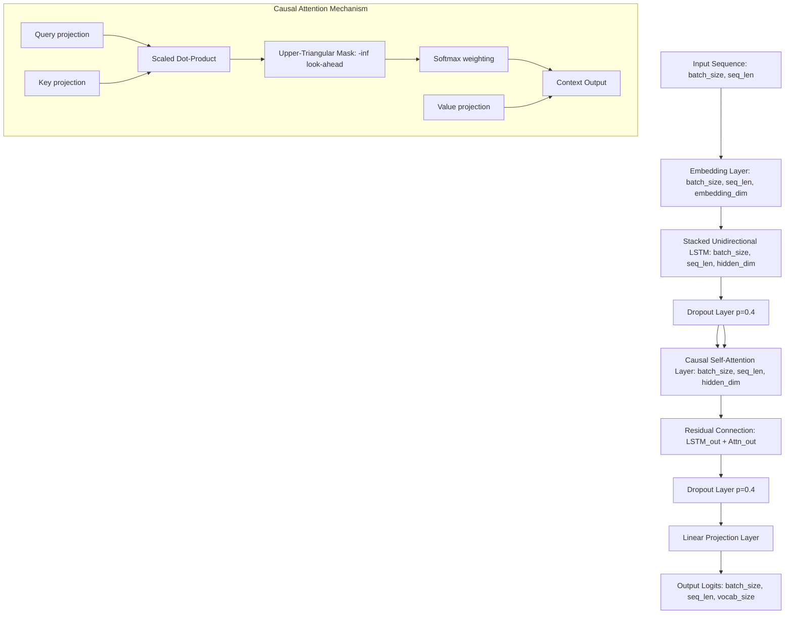
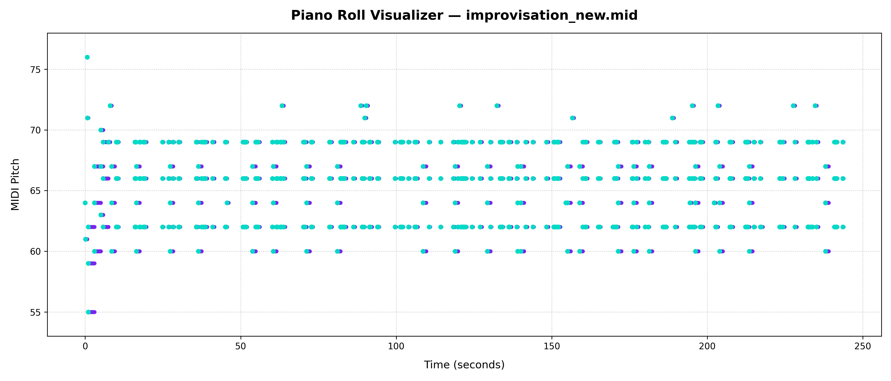

# Attention-LSTM Jazz Music Generator 🎹🎷

A production-grade, causally aligned sequence generation model in PyTorch that autoregressively generates expressive piano and jazz improvisations. The architecture features stacked Unidirectional LSTMs followed by a Causally Masked Self-Attention mechanism to learn long-range temporal dependencies without look-ahead target leakage.

---

## 🛠️ Tech Stack & Badges

[](https://www.python.org/)
[](https://pytorch.org/)
[](https://web.mit.edu/music21/)
[](https://matplotlib.org/)
[](https://opensource.org/licenses/MIT)

---

## 📐 Model Architecture

The diagram below outlines the causal tensor flow through our neural sequence layers for next-token autoregressive modeling:



*Note: Since the LSTM is strictly unidirectional and the Self-Attention scores are masked using an upper-triangular matrix, the computation at step $t$ has zero look-ahead access to future steps, guaranteeing causal autoregressive alignment.*

---

## 📂 Project Layout
*   `main.py`: Main CLI entry point. Routes `train`, `evaluate`, and `generate` operations.
*   `visualize_music.py`: Unified utility to render MIDI tracks to visual piano rolls and WAV files.
*   `plot_metrics.py`: Script to generate training curves (`metrics_plot.png`).
*   `model.py`: Neural sequence network architecture.
*   `data_pipeline.py`: MIDI chordification parsing, vocabulary expansion, and data loader setup.
*   `train.py` / `evaluate.py` / `generation.py`: Model training, validation, evaluation, and decoding steps.
*   `export.py`: Renders note-level velocities and tempo rubato for expressiveness.

---
## Here is the Google Drive Link of checkpoints, improvisation, composition, test checkpoints, test data
https://drive.google.com/drive/folders/1eucpLaiImc5BqpuyDTa_apxW-7xZBiLQ?usp=sharing

## 🚀 Reproduction Commands (`main.py`)

### 1. Installation
Ensure PyTorch and other dependencies are installed:
```bash
pip install -r requirements.txt
```

### 2. Train the Causal Model
Train the model on your MIDI folder (e.g. `data/`), tracking training metrics to `metrics.json` and validating on a 20% split:
```bash
python main.py train --data_dir data/ --model_dir checkpoints/ --epochs 50 --batch_size 64 --validation_split 0.2 --patience 10 --weight_decay 1e-4
```

### 3. Plot Training Metrics
Visualize validation curves to ensure training health:
```bash
python plot_metrics.py --metrics_file checkpoints/metrics.json --output metrics_plot.png
```
*Saves train vs validation curves to `metrics_plot.png`.*

### 4. Evaluate Generalization
Verify classification precision and support mapping over the evaluation data:
```bash
python main.py evaluate --checkpoint checkpoints/best_model.pt --vocab checkpoints/vocab.pkl --data_dir data/
```

### 5. Autoregressively Generate Music
Generate a new jazz improvisation MIDI file:
```bash
python main.py generate --checkpoint checkpoints/best_model.pt --vocab checkpoints/vocab.pkl --output improvisation.mid --num_generate 200 --temperature 1.0 --top_k 5
```

---

## 🎨 Visualizing & Rendering the Composition

We provide a visualizer script `visualize_music.py` to synthesize and plot the composition:
```bash
python visualize_music.py --midi improvisation.mid --plot piano_roll.png --wav improvisation.wav
```

### 1. Rendered Piano Roll Representation
The rendered pitch vs. time scatter grid showing note onset velocities and durations:

 <!-- REPLACE_WITH_PIANO_ROLL_IMAGE -->

### 2. Native Audio Wav Synthesis
Our native synthesis compiles note frequencies into a clean WAV audio signal (using sine synthesis) without requiring external soundfonts or Fluidsynth setups.

<audio controls>
  <source src="improvisation.wav" type="audio/wav"> <!-- REPLACE_WITH_AUDIO_FILE -->
  Your browser does not support the audio element.
</audio>
